# Finance tracker: платформа обнаружения мошеннических операций в реальном времени
## Проект для хакатона IT_ONE: Code & Analyst, 4 место

## Краткое описание
Приложение принимает запросы с данными транзакции, сохраняет в БД, проверяет на фрод и агрегирует статистику. Для удобства эксплуатации разворачивается админ-панель с возможностью просмотра транзакций, просмотра и изменения правил, выявляющих фрод транзакции, а также просмотра аналитических данных по работе приложения.

## Стек технологий

- Java
- Spring Boot
- Spring Security
- Thymeleaf
- FastAPI
- Python
- Docker & Docker Compose
- Kafka
- Flyway
- ELK, Grafana & Prometheus, Kibana
- Telegram API

## Диаграмма компонентов системы

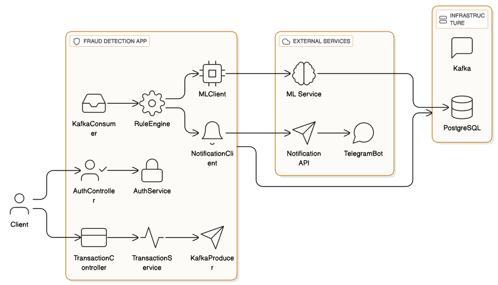

## Инструкция к запуску

1. Склонируйте репозиторий
2. Перейдите в директорию fraud-detection, соберите проект командой docker compose build
3. Запустите проект командой Docker compose up -d

Приложение использует .env файл. В рамках хакатона для удобства запуска он расположен в репозитории и имеет все нужные переменные. При необходимости переменные в .env файле можно заменить на свои.
```
DB_URL=jdbc:postgresql://postgres/fraud_detection
DB_USERNAME=
DB_PASSWORD=
JWT_SECRET=
EMAIL_LOGIN=
EMAIL_PASSWORD=
BOT_TOKEN =
```

Получение user id для бота во время регистрации осуществляется через @FroudDTBot в телеграме. Нужно отправить ему сообщение /start.

### **ВАЖНО:** 
Для доступа к дашборду необходимо войти в графану по логину и паролю **admin**.
Для отлива логов в кибане необходимо нажать на главном экране Create data view, а затем в предложенном окне написать любое название в первое поле, и logs* в следующее поле, а затем сохранить (см. фото ниже). Это нужно, чтобы добавить данные, на основе которых будет работать логгирование.

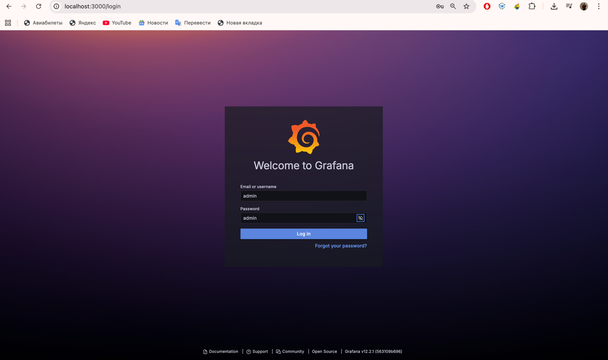
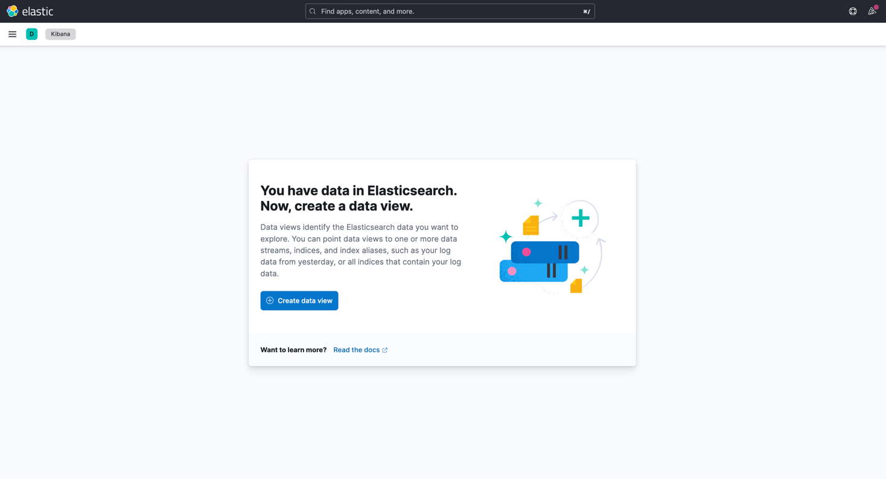
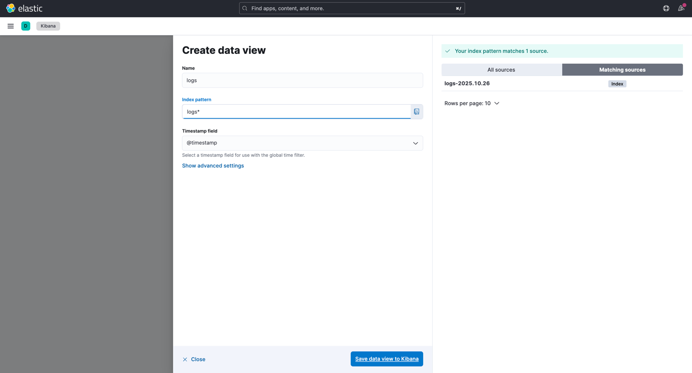

Приложение пробрасывает запросы на локальные порты. Админ-панель доступна по http://localhost:8080/, графана(статистика) на порту 3000, кибана(логи) на порту 5601, уведомления на порту 8001, МЛ модель на порту 8000.

## Описание функционала
### Запрос /transactions
Приложение принимает POST запрос /transactions

Пример запроса

Обязательными являются первые 5 параметров
```json
{
    "transaction_id" : "T100000",
    "timestamp" : "2025-10-19T02:18:00.000Z",
    "sender_account" : "ACC877572",
    "receiver_account" : "ACC388389",
    "amount" : 500,
    "transaction_type" : "withdrawal",
    "merchant_category" : "utilities",
    "location" : "Tokyo",
    "device_used" : "mobile",
    "time_since_last_transaction" : "2025-10-18T02:18:00.000Z",
    "payment_channel" : "card",
    "ip_address" : "13.101.214.112",
    "device_hash" : "D8536477"
}
```
Запрос принимается и кладётся в БД и в очередь (кафка), пользователю возвращается ответ. Запрос забирается из очереди, прогоняется через движок правил, если по итогу транзакция помечена подозрительной, зарегистрированным пользователям приходит уведомление на почту и в телеграмм.
### Движок правил
Система поддерживает 4 вида правил: Threshold, Pattern, Composite, ML. Правила применяются над транзакциями в порядке приоритета, при одном сработавшем правиле остальные не проводятся для оптимизации времени исполнения.
Первые 3 вида правил задаются json.Также стоит отметить, что имя каждого правило является уникальным и не может повторяться.<br>
#### Threshold
Пример JSON:
```json
{ "field": "amount", "operator": "EQUAL", "value": 1000}
```
В качестве field можно передать любое поле транзакции, значение этого поля сравнивается со значением value оператором. Поддерживается работа с тремя видами данных: числовой, строковой, временной.<br>
Для числовых операторы: GREATER_THAN, EQUAL, NOT_EQUAL, LESS_THAN, LESS_THAN_OR_EQUAL, GREATER_THAN_OR_EQUAL<br>
Для строковых операторы: CONTAINS, EQUAL, NOT_EQUAL, NOT_CONTAINS<br>
Для временных операторы: LESS_THAN_OR_EQUAL, GREATER_THAN_OR_EQUAL
#### Pattern
Пример JSON:
```json
{"by": "sender_account", "windowMin": 10, "operator": "EQUAL", "field": "amount", "value" : 500, "minCount": 2}
```
Поля field, operator, value аналогичные как для Threshold. Поле by задаёт группировку по какому полю транзакции мы делаем, windowMin за какое количество времени (в минутах) мы агрегируем статистику, minCount порог после которого транзакция начинает считаться мошеннической.
#### Composite
Пример JSON:
```json
{"expr": "(amount_more_than_150 AND night_hours) OR (isAmountMore(200) AND transaction_is_withdrawal)"}
```
В json для композитного правила можно класть только ссылки на существующие правила (их имена), операторы and or not и функции из DSLParser. В DSLParser определены следующие функции: isNighttime, isAmountMore, isAmountLess, isSuspiciousMerchant. Парсинг выражения работает через Abstract Syntax Tree.
#### ML
На основе датасета создана ML модель, но у пользователя есть возможность загрузить свою через админ-панель. ML модель возвращает ответ в промежутке от 0 до 1, пороговое значение для сравнения с ответом модели устанавливает пользователь. 
### Админ-панель
В админ-панели реализованы следующие страницы<br>
**/main**<br>
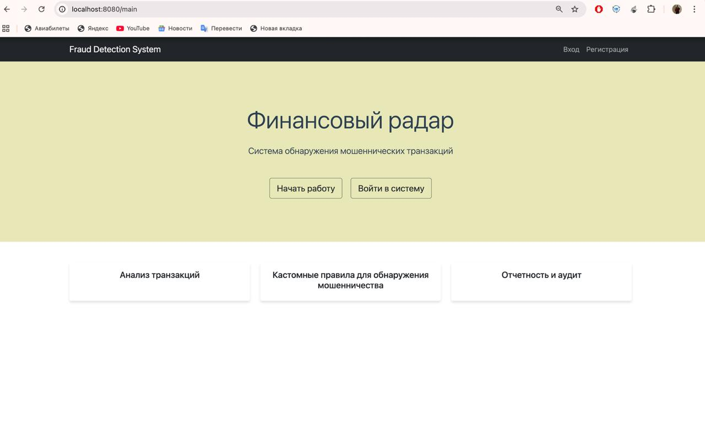<br>
Приветственная страница<br>
<br>**/signup**<br>
<br>
Страница регистрации<br>
<br>**/signin**<br>
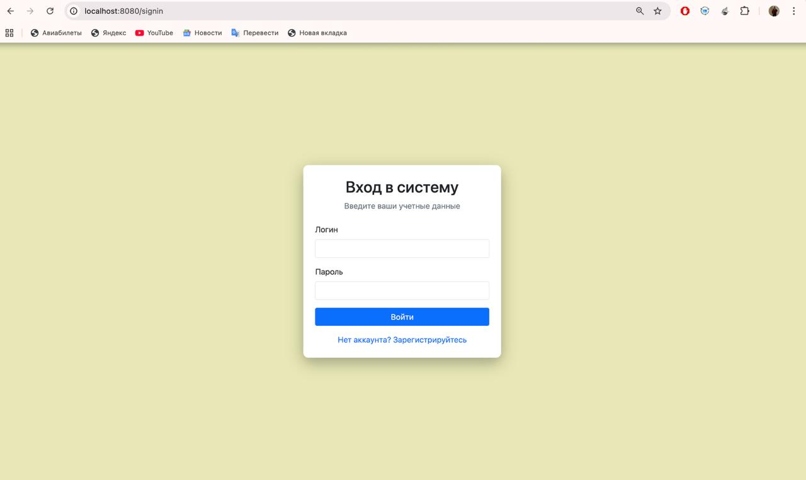<br>
Страница авторизации<br>
<br>**/rules**<br>
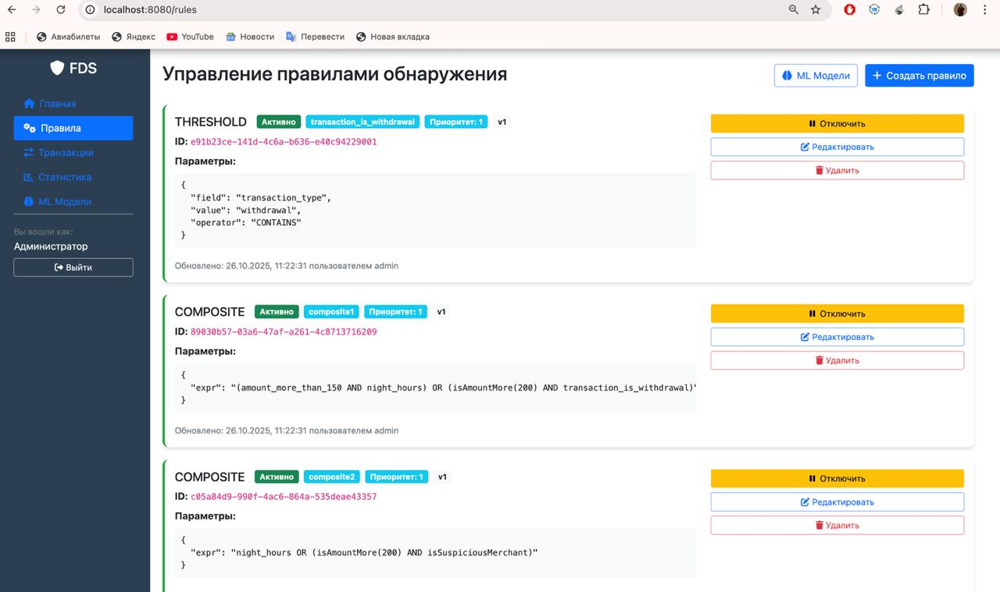<br>
Страница просмотра, добавления, редактирования правил<br>
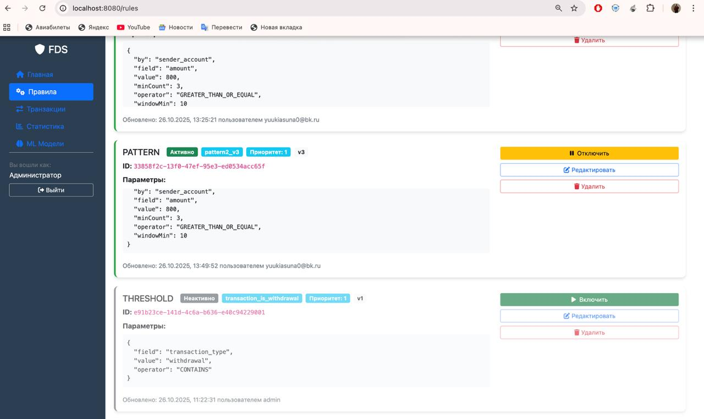<br>
Правила можно отключать
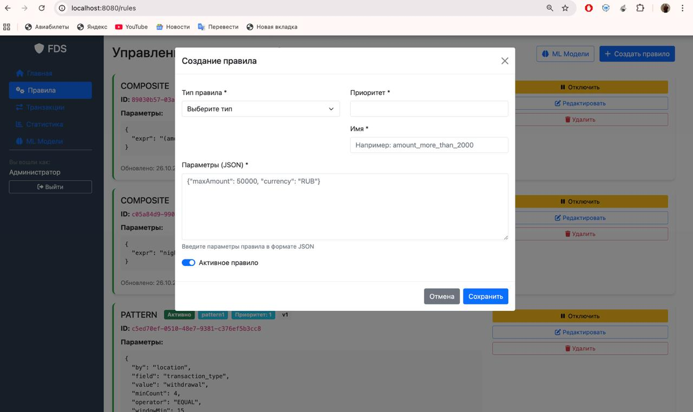<br>
Правила можно создавать, выбирая тип, назначая приоритет и имя.
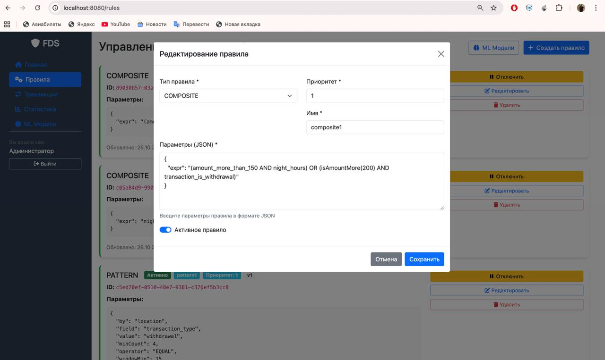<br>
Пример заполненного правила.
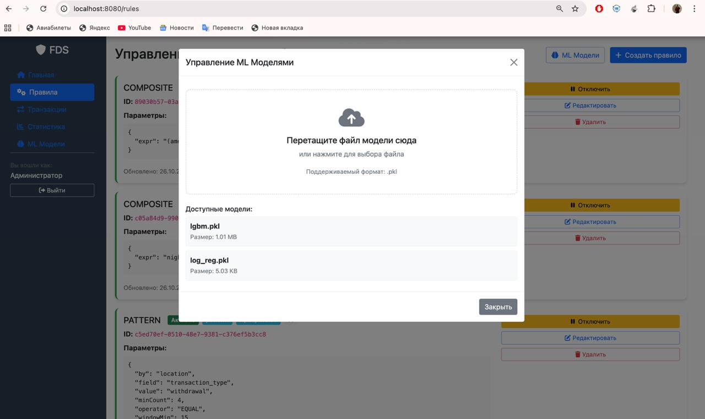<br>
Также можно добавлять или выбирать из имеющихся МЛ модель.
<br>**/transactions**<br>
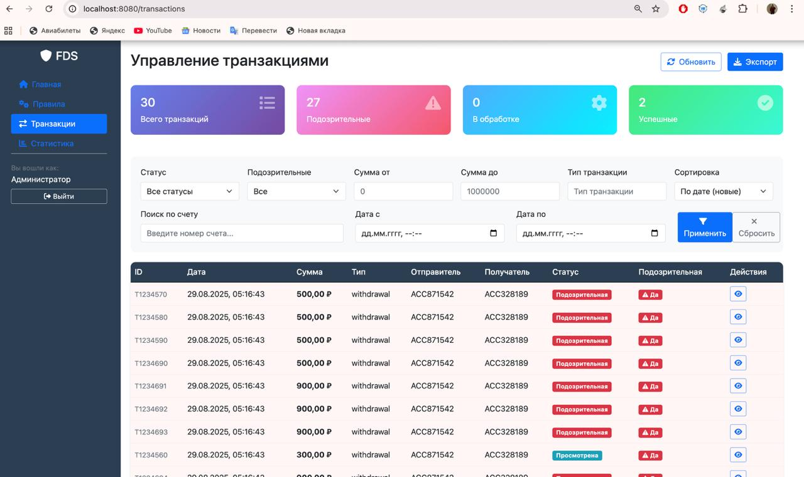<br>
Страница транзакций<br>
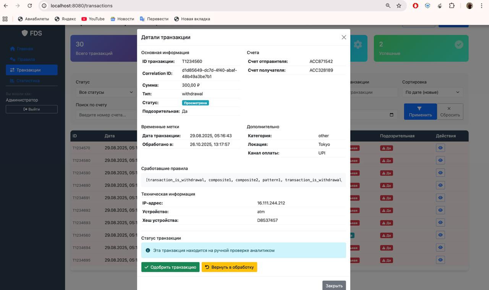<br>
Можно посмотреть детальную информацию по транзакции<br>
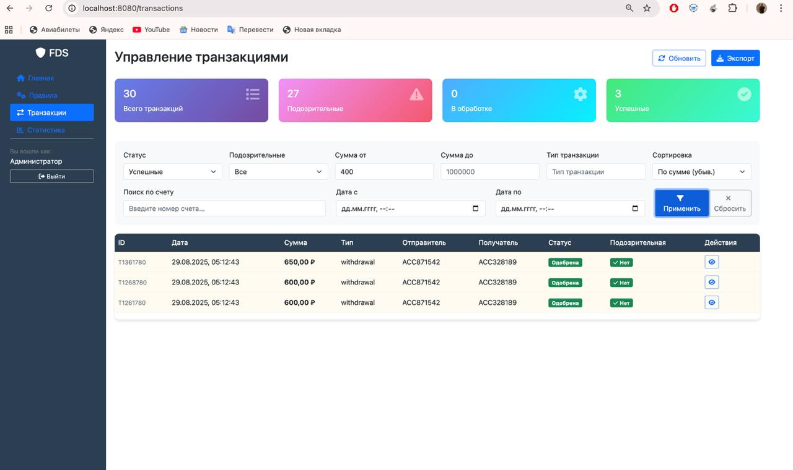<br>
Также добавлены фильтры по транзакции<br>
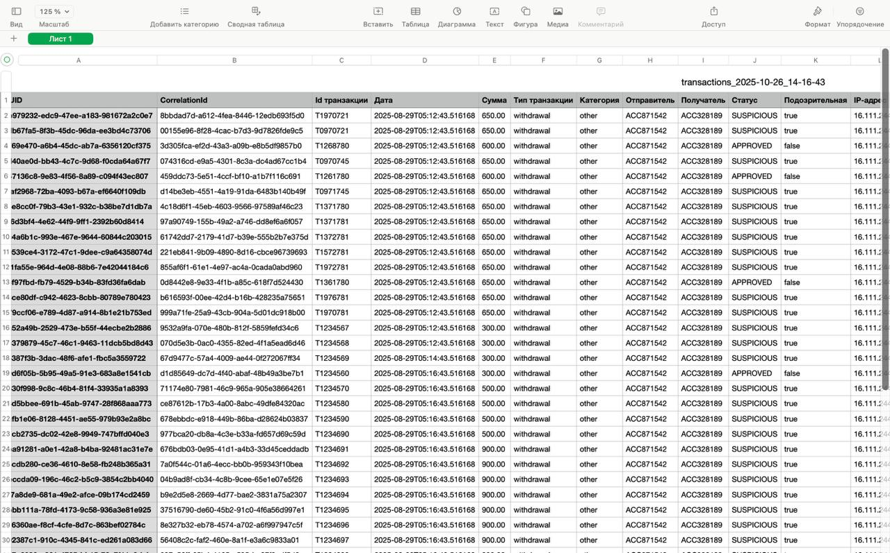<br>
Есть возможность выгрузки csv-отчёта по транзакциям<br>
<br>**/stats**<br>
Страница статистики<br>
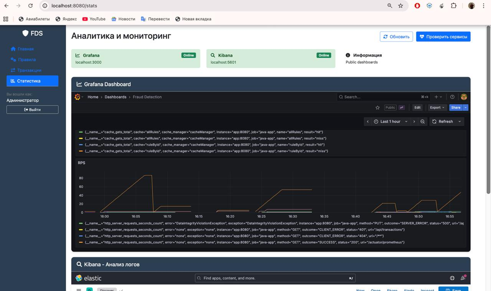<br>
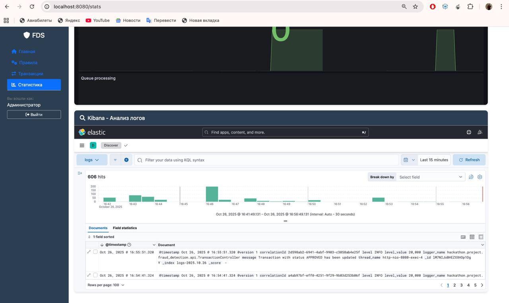<br>
Система мониторится и данные выводятся в раздел статистики, для удобства отслеживания логов реализован corellationId, который позволяет отслеживать путь транзакции. <br>
### Уведомления
<br>**Почта**<br>
Уведомления о фрод-транзакциях на почту<br>
Чтобы уведомления приходили на почту нужно указать её при регистрации<br>
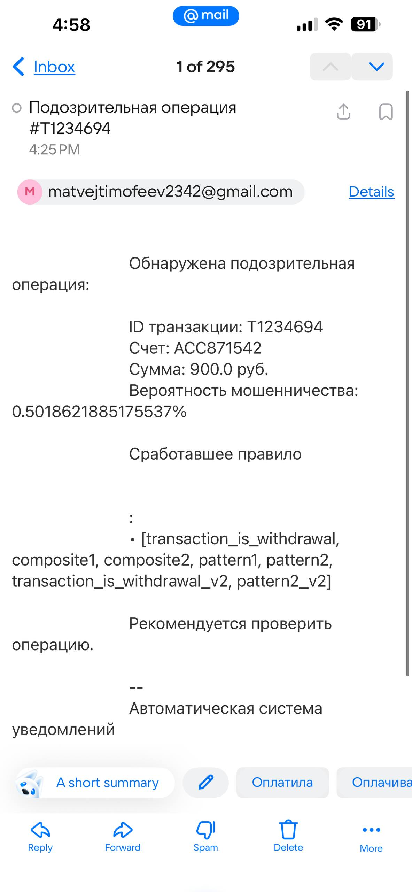<br>
<br>**ТГ**<br>
Уведомления о фрод-транзакциях в ТГ бота<br>
Что уведомления приходили в тг бота нужно предварительно запустить бота @FroudDTBot, после старта он вышлет id. Этот id нужно задать при регистрации. После этого бот будет присылать уведомления.
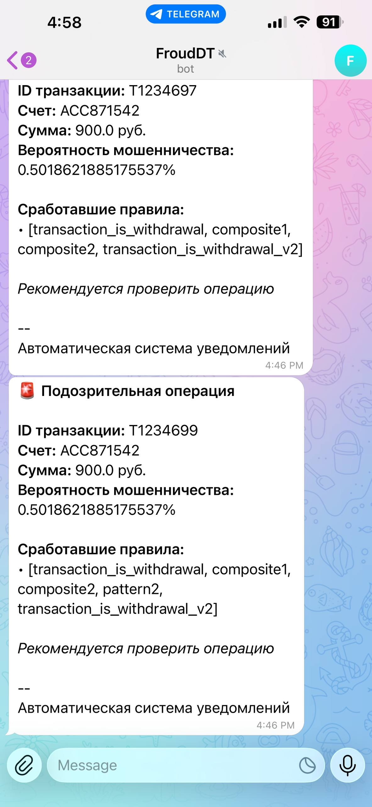<br>


